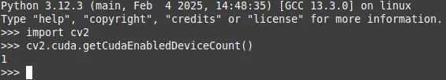

# Project Tree

```bash
uv-opecv-python-cuda
├── assets
│   └── Screenshot.webp
├── install_opencv_cuda.sh
├── LICENSE
├── clone_opencv_here
│   └── build
├── README.md
└── src
    └── your_main_project
```

# How to use

I recently need some image decoding acceleration and I found opencv might be helpful.
However, no easy `pip wheel` I can install directly with cuda acceleration.
After refering to some guidance, I successful compiled opencv with cuda acceleration and binded it with cmake.
If possible, I would like to build some `wheels` to help you guys, but I am recently busy.

All my successful practices have been decoded into the `install_opencv_cuda.sh` bash file. It looks obvious as well for those who did not `uv`.

# Screenshot

